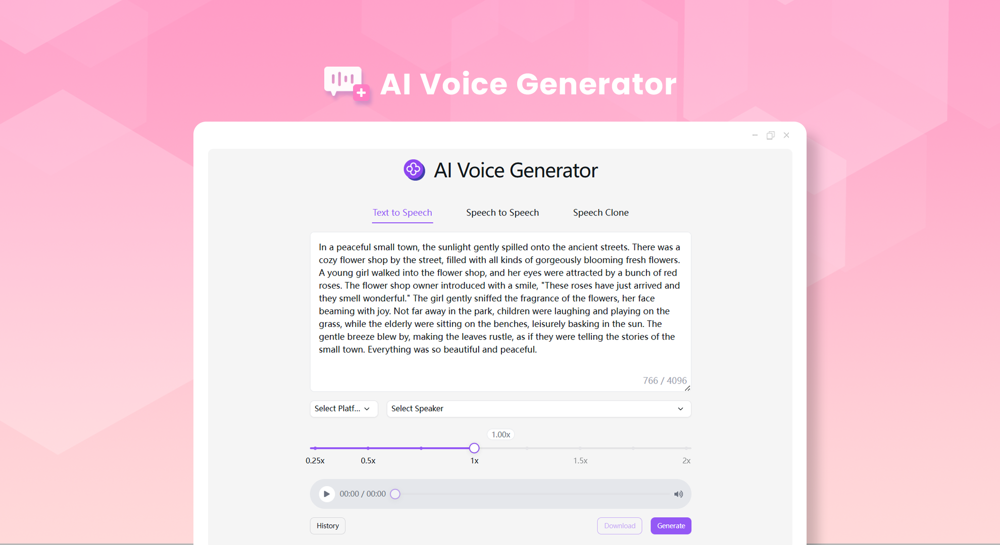
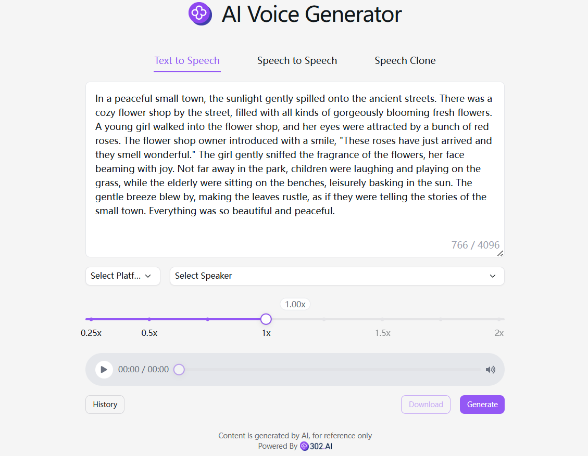

# 
🗣️ AI Voice Generator 🚀✨

The AI voice generator, through the TTS (Text-to-Speech) service, quickly generates high-quality voices that are natural, fluent, multilingual, have multiple timbres and different speaking speeds. It is applied in fields such as dubbing, voice assistants, and audiobooks, and supports models like Microsoft Azure TTS and OpenAI TTS.

<a href="README zh.md">中文</a> | <a href="README.md">English</a> | <a href="README_ja.md">日本語</a>

Open-source version of the [AI Voice Generator](https://302.ai/tools/tts/) from [302.AI](https://302.ai).
You can directly log in to 302.AI for a zero-code, zero-configuration online experience.
Alternatively, customize this project to suit your needs, integrate 302.AI's API KEY, and deploy it yourself.

## Interface Preview
Generate voice according to the input text by combining the selected voice timbre, language type and playback speed.

## Project Features
### ⚙️ Cross-platform Integration
- OpenAI
- Azure
- Doubao
- FishAudio
- Minimax
### 🌍 Multi-language Support
It supports copywriting generation in multiple languages, including but not limited to Chinese, English, Japanese, etc., helping users easily meet the content creation needs of the global market.
### 🎧 Playback and Adjustment
It supports online playback and speed adjustment.
### 🗣️ Three Main Functions
- Speech-to-text
- Voice-to-voice
- Voice cloning
### ⏺️ Upload and Download
It supports uploading audio files or recordings, and also supports downloading mp3 files.
### 📂 History Record
It saves your creation history so that nothing is forgotten, and you can download it anytime and anywhere.
### 🌐 Internationalized Interface
- Chinese
- English
- Japanese
-  Korean
- German
- French

With the AI Voice Generator, anyone can become a voice creator! 🎉💻 Let's explore the new AI-driven world of voice together! 🌟🚀

## 🚩 Future Update Plans 
- [ ] Expand the types of languages and optimize the voice models of different languages

## Tech Stack
- Next.js 14
- Tailwind CSS
- Shadcn UI

## Development & Deployment
1. Clone the project `git clone https://github.com/302ai/302_tts`
2. Install dependencies `pnpm install`
3. Configure the 302 API KEY as per .env.example
4. Run the project `pnpm dev`
5. Package and deploy `docker build -t tts . && docker run -p 3000:3000 tts`

## ✨ About 302.AI ✨
[302.AI](https://302.ai) is a pay-as-you-go AI application platform, bridging the gap between AI capabilities and practical implementation.
1. 🧠 Comprehensive AI capabilities: Incorporates the latest in language, image, audio, and video models from leading AI brands.
2. 🚀 Advanced application development: We build genuine AI products, not just simple chatbots.
3. 💰 No monthly fees: All features are pay-per-use, fully accessible, ensuring low entry barriers with high potential.
4. 🛠 Powerful admin dashboard: Designed for teams and SMEs - managed by one, used by many.
5. 🔗 API access for all AI features: All tools are open-source and customizable (in progress).
6. 💡 Powerful development team: Launching 2-3 new applications weekly with daily product updates. Interested developers are welcome to contact us.
