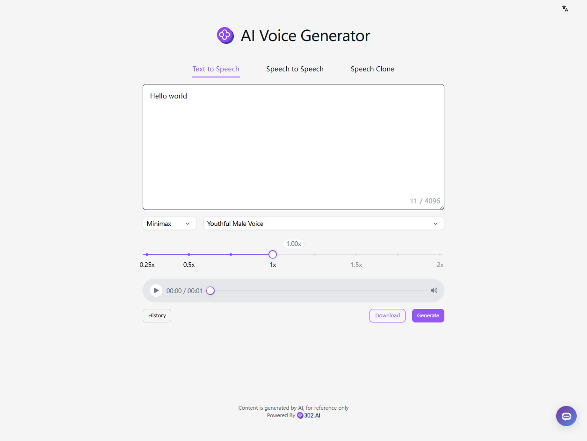

# 🗣️🤖 302.AIのAI声生成器へようこそ 🚀✨

[中文](README_zh.md) | [English](README.md) | [日本語](README_ja.md)

[302.AI](https://302.ai)の[AIコード生成器](https://302.ai/tools/tts/)のオープンソース版です。
302.AIに直接ログインすることで、コード不要、設定不要のオンライン体験が可能です。
あるいは、このプロジェクトをニーズに合わせてカスタマイズし、302.AIのAPI KEYを統合して、自身でデプロイすることもできます。

## ✨ 302.AIについて ✨
[302.AI](https://302.ai)は、AIの能力と実用的な実装の間のギャップを埋める、従量制のAIアプリケーションプラットフォームです。
1. 🧠 包括的なAI機能：主要AIブランドの最新の言語、画像、音声、ビデオモデルを統合。
2. 🚀 高度なアプリケーション開発：単なるシンプルなチャットボットではなく、本格的なAI製品を構築。
3. 💰 月額料金なし：すべての機能が従量制で、完全にアクセス可能。低い参入障壁と高い可能性を確保。
4. 🛠 強力な管理ダッシュボード：チームやSME向けに設計 - 一人で管理し、多くの人が使用可能。
5. 🔗 すべてのAI機能へのAPIアクセス：すべてのツールはオープンソースでカスタマイズ可能（進行中）。
6. 💪 強力な開発チーム：大規模で高度なスキルを持つ開発者集団。毎週2-3の新しいアプリケーションをリリースし、毎日製品更新を行っています。才能ある開発者の参加を歓迎します。

## プロジェクトの特性
1. ⚙️ クロスプラットフォーム統合：OpenAI、Azure、Doubao、FishAudio、Minimax
2. 🌍 多言語対応
3. 🎧 オンライン再生および倍速調節
4. ⬇️ mp3ファイルのダウンロード
5. 📂 生成履歴の管理と復元
6. 🗣️ 言語からテキスト、音声から音声への変換
7. 🧬 ボイスクローン
8. ⏺️ 音声ファイルのアップロード
9. 🌐 国際化されたインターフェース：中文、英語、日語、韓語、独語、仏語

AI声生成器を使って、誰でも声のクリエイターになれます! 🎉💻 AIが駆動する新しい音声の世界を一緒に探りましょう! 🌟🚀

## 技術スタック
- Next.js 14
- Tailwind CSS
- Shadcn UI

## 開発とデプロイ
1. プロジェクトをクローン `git clone https://github.com/302ai/302_tts`
2. 依存関係をインストール `pnpm install`
3. 302のAPIキーを設定してください .env.example を参考に
4. プロジェクトを実行 `pnpm dev`
5. パッケージ化してデプロイ `docker build -t tts . && docker run -p 3000:3000 tts`

## インターフェースのプレビュー

