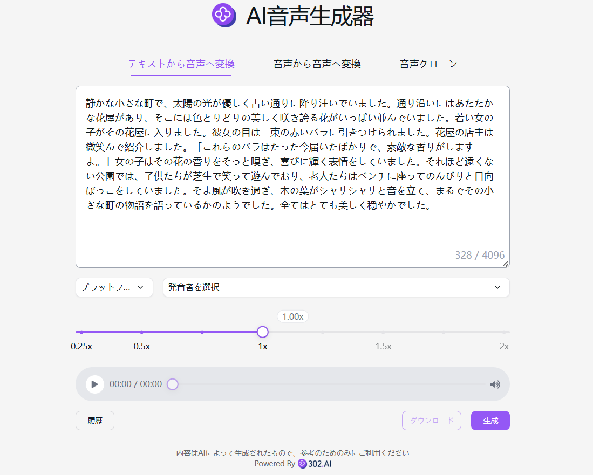

# 
🗣️ AI音声生成器 🚀✨

AI 音声生成器は、TTS（テキストから音声への変換）サービスを通じて、自然で滑らかで、多言語で、多音色で、異なる話速の高品質な音声を迅速に生成します。それは吹き替え、音声アシスタント、有声音書などの分野に応用され、Microsoft Azure TTS や OpenAI TTS などのモデルをサポートしています。

<a href="README zh.md">中文</a> | <a href="README.md">English</a> | <a href="README_ja.md">日本語</a>

[302.AI](https://302.ai)の[AIコード生成器](https://302.ai/tools/tts/)のオープンソース版です。
302.AIに直接ログインすることで、コード不要、設定不要のオンライン体験が可能です。
あるいは、このプロジェクトをニーズに合わせてカスタマイズし、302.AIのAPI KEYを統合して、自身でデプロイすることもできます。

## インターフェースのプレビュー
選択した音色、言語種類、および倍速を組み合わせて、入力されたテキストに基づいて音声を生成する。

## プロジェクトの特性
### ⚙️ クロスプラットフォーム統合
- OpenAI
- Azure- 
- 豆包
- FishAudio
- Minimax
### 🌍 多言語サポート
複数の言語の文案生成をサポートしており、中国語、英語、日本語などに限定されることなく、ユーザーが世界市場のコンテンツ作成のニーズに簡単に対応できるように支援します。
### 🎧 再生と調整
オンライン再生と倍速調整をサポートしています。
### 🗣️  3 つの主要機能
- 音声から文字への変換
- 音声から音声への変換
- 音声クローン
### ⏺️ アップロードとダウンロード
音楽ファイルや録音をアップロードすることをサポートし、mp3 ファイルのダウンロードもサポートしています。
### 📂 履歴記録
あなたの創作履歴を保存し、記憶が失われることがなく、いつでもどこでもダウンロードできます。
### 🌐 インターナショナル化されたインターフェース
- 中国語
- 英語
- 日本語
- 韓国語
- ドイツ語
- フランス語

AI声生成器を使って、誰でも声のクリエイターになれます! 🎉💻 AIが駆動する新しい音声の世界を一緒に探りましょう! 🌟🚀

## 🚩 将来のアップデート計画
- [ ] 言語の種類を拡充し、異なる言語の音声モデルを最適化する

## 技術スタック
- Next.js 14
- Tailwind CSS
- Shadcn UI

## 開発とデプロイ
1. プロジェクトをクローン `git clone https://github.com/302ai/302_tts`
2. 依存関係をインストール `pnpm install`
3. 302のAPIキーを設定してください .env.example を参考に
4. プロジェクトを実行 `pnpm dev`
5. パッケージ化してデプロイ `docker build -t tts . && docker run -p 3000:3000 tts`

## ✨ 302.AIについて ✨
[302.AI](https://302.ai)は、AIの能力と実用的な実装の間のギャップを埋める、従量制のAIアプリケーションプラットフォームです。
1. 🧠 包括的なAI機能：主要AIブランドの最新の言語、画像、音声、ビデオモデルを統合。
2. 🚀 高度なアプリケーション開発：単なるシンプルなチャットボットではなく、本格的なAI製品を構築。
3. 💰 月額料金なし：すべての機能が従量制で、完全にアクセス可能。低い参入障壁と高い可能性を確保。
4. 🛠 強力な管理ダッシュボード：チームやSME向けに設計 - 一人で管理し、多くの人が使用可能。
5. 🔗 すべてのAI機能へのAPIアクセス：すべてのツールはオープンソースでカスタマイズ可能（進行中）。
6. 💪 強力な開発チーム：大規模で高度なスキルを持つ開発者集団。毎週2-3の新しいアプリケーションをリリースし、毎日製品更新を行っています。才能ある開発者の参加を歓迎します。
