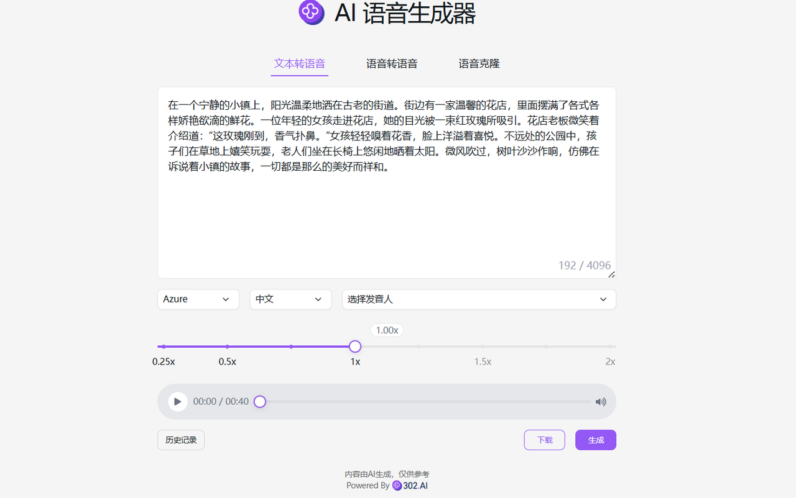

# 
🗣️ AI 语音生成器 🚀✨

AI语音生成器通过TTS(文字生成语音)服务，快速生成自然流畅、多语言、多音色、不通语速的高质量语音，应用于配音、语音助手、有声读物等领域，支持Microsoft Azure TTS和OpenAI TTS等模型。

<a href="README zh.md">中文</a> | <a href="README.md">English</a> | <a href="README_ja.md">日本語</a>

来自[302.AI](https://302.ai)的[AI语音生成器](https://302.ai/tools/tts/)的开源版本。你可以直接登录302.AI，零代码零配置使用在线版本。或者对本项目根据自己的需求进行修改，传入302.AI的API KEY，自行部署。

## 界面预览
结合选择的音色、语种和倍速，根据输入的文本生成语音。

## 项目特性

### ⚙️ 跨平台集成
 -  OpenAI
 -  Azure
 -  豆包
 -  FishAudio
 -  Minimax
### 🌍 多语言支持
  支持多种语言的文案生成，包括但不限于中文、英文、日文等，帮助用户轻松应对全球市场的内容创作需求。
### 🎧 播放与调节
  支持在线播放与倍速调节。
### 🗣️ 三大功能
  - 语言转文字
  - 语音转语音
  - 声音克隆
### ⏺️ 上传与下载
  支持上传音频文件或录音，也支持下载mp3文件
### 📂 历史记录
  保存您的创作历史,记忆不丢失，随时随地都可以下载。
### 🌐 界面国际化
  - 中文
  - 英文
  - 日文
  - 韩文
  - 德文
  - 法文

通过AI语音生成器,任何人都可以成为语音创作者! 🎉💻 让我们一起探索AI驱动的语音新世界吧! 🌟🚀

## 🚩 未来更新计划
- [ ] 扩充语言种类，优化不同语言的语音模型
  
## 技术栈
- Next.js 14
- Tailwind CSS
- Shadcn UI

## 开发&部署
1. 克隆项目 `git clone https://github.com/302ai/302_tts`
2. 安装依赖 `pnpm install`
3. 配置302的API KEY 参考.env.example
4. 运行项目 `pnpm dev`
5. 打包部署 `docker build -t tts . && docker run -p 3000:3000 tts`

## ✨ 302.AI介绍 ✨
[302.AI](https://302.ai)是一个按需付费的AI应用平台，为用户解决AI用于实践的最后一公里问题。
1. 🧠 集合了最新最全的AI能力和品牌，包括但不限于语言模型、图像模型、声音模型、视频模型。
2. 🚀 在基础模型上进行深度应用开发，我们开发真正的AI产品，而不是简单的对话机器人
3. 💰 零月费，所有功能按需付费，全面开放，做到真正的门槛低，上限高。
4. 🛠 功能强大的管理后台，面向团队和中小企业，一人管理，多人使用。
5. 🔗 所有AI能力均提供API接入，所有工具开源可自行定制（进行中）。
6. 💡 强大的开发团队，每周推出2-3个新应用，产品每日更新。有兴趣加入的开发者也欢迎联系我们
